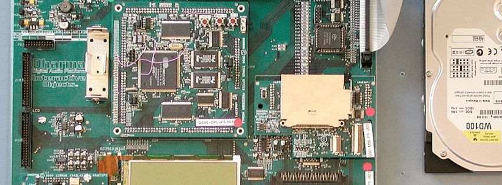

## Interactive Objects / Fullplay Media Source Code

    



The following codebase was developed at the aforementioned companies between 1998 and 2006. The code comprises of various configurations of an embedded media player or commonly known as mp3 players. 

The software stack system supports a number of hardware architectures, specifically, [Windows CE MIPS VR4111 (first generation PalmPC)](https://www.eetimes.com/nec-electronics-vr4111-cpu-at-the-heart-of-casios-new-cassiopeia-e-10-palm-pc/#), [Window CE Pocket PC Casseopia (VR4121)](https://www.digchip.com/datasheets/download_datasheet.php?id=1039903&part-number=VR4121), [Microsoft's First Generation AutoPC (SH3)](https://www.cnet.com/news/clarion-to-build-autopc-using-ms-software/), [Cirrus Logic Maverick (7412)](http://ecos.sourceware.org/ecos/boards/edb7212.html).  Additionally, the software sits on top of [eCos](http://ecos.sourceware.org/). So in summary, MIPS, SH3, and ARM.

The Dharma system (above) included all the peripherals and software needed to create any permutation of a digital media device you wanted.  Centered around the (super low cost) Cirrus Logic Maverick 7212, an ARM7 with internal 32kb of SRAM and access to both 16bit or 32bit wide FLASH. As you can see from the picture above, the system supported ethernet, CD-ROM, HDD, Dataplay, SD, MMC, and Smart Media was supported as well as various sized LCD 2-bit, 4-bit, etc. In the 1998 the feature ot differentiate was what was the storage, how easy was it to use, and where did you get your content. For example, cutting edge format plays such as [Dataplay](https://www.bizjournals.com/denver/stories/2001/06/04/daily41.html) was also supported.

## Removed code

_The Microsoft Windows Media Codec has been removed due to licensing restrictions. As well as the FreeDB .dat file, circa 1998.  If you need this, let me know._

## MIT License

_Developers listed in alphabetical order._

Copyright (c) 1998-2020 Benjamin Eitzen, Dan Conti, Daniel Bolstad, Daniel Coughlin, Edward Miller, Ezra Dreisbach, James Zipperer, Kenneth Gordon, Matthew Tadd, Morgan Belford, Noah Maas, Phil Rutchman, Todd Malsbury, A DOT Corporation.

The above copyright notice and this permission notice shall be included in all
copies or substantial portions of the Software.

See License.MD file for complete License.

## Background

Mp3 had just been approved for a streaming audio format, the [RIO](https://en.wikipedia.org/wiki/Rio_PMP300) was released in Korea and I had a [Sony mini-disc](https://en.wikipedia.org/wiki/MiniDisc) which I wondered why I couldn't connect the disk to a PC or write arbitrary data as the 170MB were dedicated to the propritary ATRAC format. PC audio jukeboxes were not a thing, storage and [RAM were prohibatively expensive](https://mkomo.com/cost-per-gigabyte). Palm Pilot was the dominate handheld. From the date of the idea to create an mp3 player for a pocket device, my collegues Ed Miller, Matt Tadd, and myself worked on a half dozen hardware platforms, none of which were powerful enough to decode faster than realtime, resulting in audio stutters. First generation PocketPC, AutoPC, even the first generation mp3 player RIO (Micronas 3507D) were all unable work. Additionally, Compact Flash storage was between 4 to 128 MBs, at about $1 per MB. Six months later, we recieved the Casio E-100 prototype, and our player worked. _Moral: You have to fail alot before succeeding, its part of the process._

 Windows Media only playback, first digital audio portable player. circa 1998.

## Fixed point

AThe first Casio PalmPC Casseopia running Microsoft Windows CE used the [NEC VR4111 MIPS processor](https://www.datasheetarchive.com/pdf/download.php?id=f32cdf2af5921ab5d768596e7ec686c4a8df45&type=P&term=VR4111). I acquired the rights to a reference mp3 implementation, using this as a starting point, analyzed the VR4111 processor specification and the output of C code from Microsft Visual Studio compiler for Windows CE.  Inefficiencies in the compilation and unsupported assembly were significant issues to overcome. Below are the highlights. 

First moving floats to fixed point.

```
#ifdef REAL_IS_FIXED
#define WRITE_SAMPLE(samples, sum, clip)         \
    if (sum.i > (32767 << FRACBITS))             \
    {                                            \
        *(samples) = 0x7fff;                     \
    }                                            \
    else if (sum.i < (-32768 << FRACBITS))       \
    {                                            \
        *(samples) = -0x8000;                    \
    }                                            \
    else                                         \
    {                                            \
        *(samples) = (short)(sum.i >> FRACBITS); \
    }
#elif defined(REAL_IS_INT)
```

Create an abstraction for the fixed point mulitplication. 

```
inline int mult_real(int a, int b)
{
    int result;

#if defined(UNDER_CE) && defined(OPT_MULTREAL) 
    #if defined(_MIPS_)     
#if 1
        __asm("mult %0,%1",a,b);
        __asm("mflo %t1");
        __asm("srl %t1,%t1,15");  //FRACBITS
        __asm("mfhi %t2");
        __asm("sll %t2,%t2,32-15"); //FRACBITS
        __asm("or %t2,%t2,%t1");
        __asm("sw %t2,0(%0)",&result); 
#else    
        __asm("mult %0,%1",a,b);
        __asm("mflo %t1");
        __asm("mfhi %t0");
        __asm("dsrl %t0,%t0,15");  //FRACBITS
        __asm("sw %t1,0(%0)",&result); 
#endif
    #elif defined(_SH3_)
        __asm("mov.l   @R4,R2",&b);
        __asm(
              "mov     #H'FFFFFFF1,R0\n"  //FFFFFFF1 = -15
              "mov.l   @R4,R3\n"
              "dmuls.l R3,R2\n"
              "sts     MACL,R3\n"
              "sts     MACH,R2\n"
              "shld    R0,R3\n"
              "mov     #D'17,R0\n"
              "shad    R0,R2\n"
              "or      R2,R3\n"
              "mov.l   R3,@R5\n",
              &a, &result);
    #elif defined(_SH4_)
        __asm("mov.l   @R4,R2\n"
              "mov.l   @R5,R3\n",&a,&b);
        __asm("dmuls.l R3,R2");
        __asm("sts     MACL,R3");
        __asm("sts     MACH,R0");
        __asm("mov     #-15,R1");  //FFFFFFF4 = -15              
        __asm("shld    R1,R3");
        __asm("mov     #17,R1");
        __asm("shld    R1,R0");
        __asm("or      R3,R0");
        __asm("mov.l   R0,@R4",&result);
    #endif
#else
     result = (int)((((LONGLONG)a)*((LONGLONG)b))>>FRACBITS);
#endif  //UNDER_CE
    return result;
}

```

And time the output. Basically, you need a second of audio to be decoded within a second. 

Find processors which have special operations generally called multiply and accumilate.  Using the MACC to speed up the decode process.

```
#elif defined(_MIPS_) && defined(MIPS_4111)
            LONGLONG _sum, tmp;
            _sum = 0;

            mips_macc(-*(--window), *b0++, &tmp);
            _sum += tmp;
            mips_macc(*(--window), *b0++, &tmp);
            _sum -= tmp;
            mips_macc(*(--window), *b0++, &tmp);
            _sum -= tmp;
      
            ...
      
            mips_macc_end(_sum, &sum);
```

NEC's VR4111 provided the madd16 operator which worked.

```
    __asm("lw %t3,0(%0);" //load pointer to first array in %t3
          "lw %t4,0(%1);" //load pointer to second array in %t4
          "mtlo zero;"      //clear accumulate register
          "mthi zero;",
          &window, &b0);

    __asm("lw %t5,0x0(%t3);" //load value from %t3 at offset 0 (index 0)
          "lw %t6,0x0(%t4);" //load value from %t4 at offset 0
          "madd16 %t5,%t6;"
          //".word 0x01AE0028;"    //macc %t5, %t6

          "lw %t5,0x4(%t3);"  //load value from %t3 at offset 4 (index 1)
          "sub %t5,zero,%t5;" //negate %t5
          "lw %t6,0x4(%t4);"  //load value from %t4 at offset 4
          "madd16 %t5,%t6;"
          //".word 0x01AE0028;"    //macc %t5, %t6

          "lw %t5,0x8(%t3);" //load value from %t3 at offset 8 (index 2)
          "lw %t6,0x8(%t4);" //load value from %t4 at offset 8
          "madd16 %t5,%t6;"
          //".word 0x01AE0028;" //macc %t5, %t6
    
           ...

```


